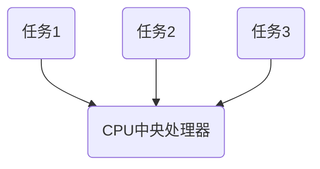
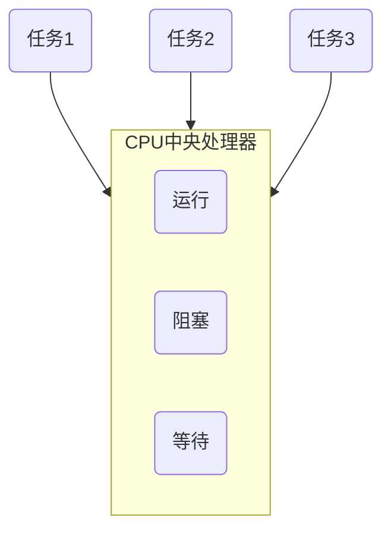
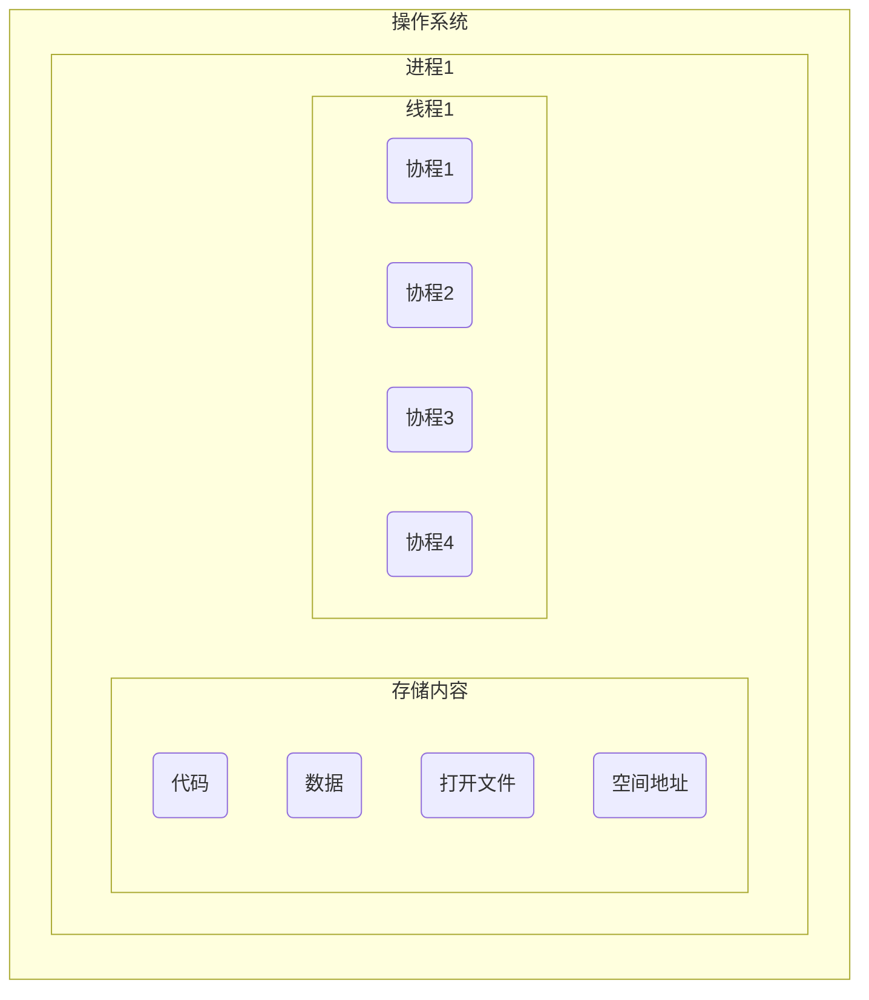

[TOC]


# 第十节 用程序指挥浏览器

## 什么是selenium

Selenium 是一个用于Web应用程序测试的工具。Selenium测试直接运行在浏览器中，就像真正的用户在操作一样。

## selenium中文文档

https://selenium-python-zh.readthedocs.io/en/latest/locating-elements.html

## 测试网站

https://xiaoke.kaikeba.com/example/X-Man/

## 安装selenium

pip install selenium

## 下载安装浏览器的驱动

http://npm.taobao.org/mirrors/chromedriver/

## 查看谷歌浏览器版本

帮助-》关于谷歌 chrome


谷歌内核版本需要与浏览器的版本匹配

## chromedriver.exe存放目录

存放在anaconda的外层Scripts目录下


## Selenium提取数据的常用方法


查看源代码字符串

```python
html = driver.page_source
```

查看属性字符串

```python
Tag.get_attribute()
```

提取文本信息

```python
Tag.text
```

## 模拟清除和点击

```python
.send_keys()
.click()
.clear() 清除元素内容
```


## WebElement和Tag用法对比


## 简单流程


## selenium跳转页面

```python
import time
from selenium import webdriver

#设置引擎为chrome，从本地打开Chrome
driver = webdriver.Chrome(executable_path='D:\爬虫班级资料\爬虫10-12 讲课资料\chromedriver_win32\chromedriver.exe')

#访问页面
# driver.get('https://xiaoke.kaikeba.com/example/X-Man/')
driver.get('https://www.baidu.com/?tn=99205150_hao_pg')
#查看页面代码
# html = driver.page_source
input_data = driver.find_element_by_id('kw')
input_data.send_keys('故宫')
#
time.sleep(1)
ele_su = driver.find_element_by_id('su')
ele_su.click()
time.sleep(2)
driver.close()

```


## selenium静默运行模式

```python
from selenium import webdriver
from selenium.webdriver.chrome.options import Options

#静默模式设置
chrome_options = Options()
chrome_options.add_argument('--headless')
driver = webdriver.Chrome(options=chrome_options)

```

## selenium保存图片

保存图片

```python
driver.save_screenshot('D:\爬虫班级资料\爬虫10-12 讲课资料\BreezePython1.png')
```

加上下面这句话，设置最大窗口，保存全图

```python
driver.maximize_window()
```

## 非静默模式代码示例

```python
import time
from selenium import webdriver

#非静默模式：设置引擎为chrome，从本地打开Chrome
driver = webdriver.Chrome()

#设置窗口为最大窗口
driver.maximize_window()
#访问页面
driver.get('https://www.baidu.com/?tn=99205150_hao_pg')

#查看页面代码
# html = driver.page_source
#查找输入位置，并且发送查询信息
input_data = driver.find_element_by_id('kw')
input_data.send_keys('故宫')

time.sleep(1)
ele_su = driver.find_element_by_id('su')
ele_su.click()
time.sleep(2)
#截图：中文路径有时无法识别，前面可以加上u
driver.save_screenshot('D:\爬虫班级资料\爬虫10-12 讲课资料\BreezePython1.png')

driver.close()

```

## 静默模式代码示例

```python
import time
from selenium import webdriver
from selenium.webdriver.chrome.options import Options

#静默模式设置
chrome_options = Options() # 实例化Option对象
chrome_options.add_argument('--headless') # 把Chrome浏览器设置为静默模式
driver = webdriver.Chrome(options = chrome_options) # 设置引擎为Chrome，在后台默默运行

#访问页面
driver.get('https://www.baidu.com/?tn=99205150_hao_pg')
# #设置窗口为最大窗口
# driver.maximize_window()

#查看页面代码
# html = driver.page_source
#查找输入位置，并且发送查询信息
input_data = driver.find_element_by_id('kw')
input_data.send_keys('故宫')

time.sleep(1)
ele_su = driver.find_element_by_id('su')
ele_su.click()
time.sleep(2)
#截图：中文路径有时无法识别，前面可以加上u
driver.save_screenshot('D:\爬虫班级资料\爬虫10-12 讲课资料\BreezePython3.png')

driver.close()

```


## 发表评论代码示例

```python
import time
from selenium import webdriver

#调用谷歌内核
driver = webdriver.Chrome()
#请求网站
driver.get('https://xiaoke.kaikeba.com/example/wordpress/')

#进入可以发表评论的页面
title = driver.find_element_by_class_name('entry-title').find_element_by_tag_name('a')
title.click()

#点击进入登录页面
driver.find_element_by_class_name('must-log-in').find_element_by_tag_name('a').click()
#输入账号密码
login_user = driver.find_element_by_id('user_login')
user = input('输入用户名：')
login_user.send_keys(user)

user_pass = driver.find_element_by_id('user_pass')
pw = input('请输入密码：')
user_pass.send_keys(pw)

#点击登录
wp_submit = driver.find_element_by_id('wp-submit')
wp_submit.click()

#登录上去之后发表评论
comment_area = driver.find_element_by_id('comment')
comment = input("请输入你想要评论的内容:")
comment_area.send_keys(comment)

#点击发表评论
driver.find_element_by_id('submit').click()

time.sleep(7)
driver.close()

```

# 第十一节 让爬虫定时向你汇报

## 爬取的网站

中国天气网：http://www.weather.com.cn/

# 第十二节 建立爬虫军队

## 异步与同步

异步：一个任务未完成时，其他多个任务可以正常执行，任务之间互不影响

同步：一个任务结束，才能启动下一个任务

## 异步的优点

在爬取多个网站的时候速度快，优势明显

### CPU调度示意图

抢占式：谁抢到谁执行



非抢占式：多协程--非抢占式的异步技术，任务在执行过程中，如果遇到等待，就先去执行其他的任务，当等待结束，再回来继续之前的那个任务。






## gevent库

### gevent模块不能使用解决方法

```
Process finished with exit code -1073741819 (0xC0000005)
```

卸载gevent,重装新的gevent

```
pip uninstall gevent
pip install gevent==20.5
```

### 协程示例代码

```python
from gevent import monkey
monkey.patch_all()

import gevent
import time
import requests

start_time = time.time()

url_list = ['https://www.baidu.com/',
'https://www.sina.com.cn/',
'http://www.sohu.com/',
'https://www.qq.com/',
'https://www.163.com/',
'http://www.iqiyi.com/',
'https://www.tmall.com/',
'http://www.ifeng.com/'
]

def crawler(url):
    r = requests.get(url)
    print(url,time.time(),r.status_code)

#建立任务表
tasks_list = []

for url in url_list:
    #gevent.spawn(crawler,url)就是创建一个执行crawler函数的任务，参数为crawler函数名和它自身的参数url
    task = gevent.spawn(crawler,url)
    tasks_list.append(task)

gevent.joinall(tasks_list)
end_time = time.time()
print('总共花费时间%ss'%(end_time-start_time))
```

```mermaid

```


## Queue模块


