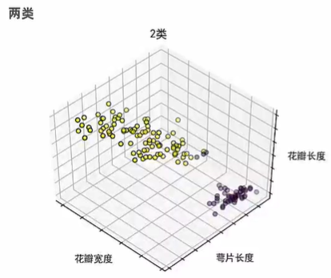

[TOC]

# 第十章 机器学习

## 机器学习


### 什么情况下使用机器学习

- 要解决的问题中存在某种模式；
- 这种模式不容易直接被定义；
- 有足够的数据可以帮助我们找出该模式。

### 机器学习分类

根据训练样本是否带有标签分为：

- 监督学习
- 非监督学习


## 监督学习

​	机器学习：利用已有数据进行预测

​	监督学习：使用带有标签和特征的数据进行预测

### 案例研究---客户流失预测


### 客户流失预测


### 监督学习

- 基于数据做预测
- 数据有特征和标签
  - 标签：想要预测什么
  - 特征：可能预测出标签的数据
- 经过训练的模型可以做出预测

### 对模型进行评估


## 监督学习常见算法

### 线性回归

```python
import numpy as np
import pandas as pd
import matplotlib.pyplot as plt
from scipy.stats import pearsonr
from sklearn.linear_model import LinearRegression

dataset1 = pd.DataFrame({
    'x':[10,8,13,9,11,14,6,4,12,7,5],
    'y':[8.04,6.95,7.58,8.81,8.33,9.96,7.24,4.26,10.84,4.82,5.68]
})

dataset2 = pd.DataFrame({
    'x':[8,8,8,8,8,8,8,19,8,8,8],
    'y':[6.58,5.76,7.71,8.84,8.47,7.04,5.25,12.50,5.56,7.91,6.89]
})


features1 = dataset1['x'].reshape(-1,1)
target1 = dataset1['y'].reshape(-1,1)

feature2 = dataset2['x'].reshape(-1,1)
target2 = dataset2['y'].reshape(-1,1)

#训练第一个线性模型
regression1 = LinearRegression()
model1 = regression1.fit(features1,target1)
t0,t1 = regression1.intercept_[0],regression1.coef_[0][0]
#截距和斜率
# print(t0,t1)

#皮尔逊相关系数计算
r1 = pearsonr(dataset1['x'],dataset1['y'])
r2 = pearsonr(dataset2['x'],dataset2['y'])


#训练第二个线性模型
regression2 = LinearRegression()
model2 = regression2.fit(feature2,target2)
d0,d1 = regression2.intercept_[0],regression2.coef_[0][0]
#截距和斜率
# print(d0,d1)
print('*'*100)
print('dataset1和dataset2中x的均值：',dataset1['x'].mean(),dataset2['x'].mean())
print('dataset1和dataset2中y的均值：',dataset1['y'].mean(),dataset2['y'].mean())

print('*'*100)
print('dataset1和dataset2中x的均值：',dataset1['x'].var(),dataset2['x'].var())
print('dataset1和dataset2中y的均值：',dataset1['y'].var(),dataset2['y'].var())

print('*'*100)
print('dataset1中的相关系数：',r1)
print('dataset2中的相关系数：',r2)


plt.figure(figsize=(8,4),dpi=80)

#拟合第一个模型的直线
plt.subplot(121)
plt.scatter(dataset1['x'],dataset1['y'])

xpre=np.linspace(0,18,num=50,endpoint=True) #创建用于预测的x值
ypre=regression1.predict(xpre[:,np.newaxis])
plt.plot(xpre,ypre,"-",label="degree 1")


#拟合第二个模型的指向
plt.subplot(122)
plt.scatter(dataset2['x'],dataset2['y'])

xpre2=np.linspace(0,18,num=50,endpoint=True) #创建用于预测的x值
ypre2=regression2.predict(xpre2[:,np.newaxis])
plt.plot(xpre2,ypre2)


plt.show()
```


# 第十一章 聚类

## 聚类是什么

将数据分类，聚类是非监督学习中的一部分

## 聚类和分类的区别

​		在进行分类之前，我们事先已经有了一套数据划分标准，只需要严格按照标准进行数据分组就可以了；
​		而聚类则不同，我们并不知道具体的划分标准，要靠算法进行判断数据之间的相似性，把相似的数据放在一起，也就是说聚类最关键的工作是：探索和挖掘数据中的潜在差异和联系。

## 聚类用处

将未标记的数据集划分为不同类别

- 客户细分：：对客户进行细分，分析每类客户的特征及用户价值度，以便制定不同的运营策略，创造更大利润。
- 图像分割：把图像分成若干个特定的、具有独特性质的区域
- 异常检测：发现正常与异常的用户数据，识别其中的欺诈行为
- 等

## 聚类步骤

1. 选择特征
2. 选择聚类数目
3. 使用聚类解决实际问题

## 监督与非监督


## 发现新品种

- 定义特征

  - 花的颜色
  - 花瓣的长度和宽度
  - 花萼的长度和宽度
  - 花瓣数

  

- 定义聚类数

  - 一类

    - 

  - 两类

    - 

  - 三类

    - 
      - 更多类
      - 聚类的数量由自己决定

    

## 鸢尾花聚类代码展示

```python
import numpy as np
import matplotlib.pyplot as plt
from mpl_toolkits.mplot3d import Axes3D
from sklearn.cluster import KMeans
from sklearn import datasets
import matplotlib.font_manager as font_manager

plt.rcParams['font.sans-serif']='SimHei'
plt.rcParams['axes.unicode_minus']=False

# 设置随机种子
# np.random.seed(5)

# 加载需要的鸢尾花数据集
iris = datasets.load_iris()
X = iris.data
Y = iris.target

# 设置聚类数目
est = KMeans(n_clusters = 3)
#训练数据
est.fit(X)

#分类结果
labels = est.labels_

#绘制图形
fig = plt.figure(1, figsize = (5, 4),dpi = 150)

ax = Axes3D(fig, rect = [0, 0, .95, 1], elev = 48, azim = 134)

#edgecolor = 'k' 设置边界
ax.scatter(X[:, 3], X[:, 0], X[:, 2],c = labels.astype(np.float), edgecolor = 'k')

#设置x,y,z上的数字不显示
ax.w_xaxis.set_ticklabels([])
ax.w_yaxis.set_ticklabels([])
ax.w_zaxis.set_ticklabels([])

#设置x,y,z标签名和字大小
ax.set_xlabel('花瓣宽度',size=10)
ax.set_ylabel('萼片长度',size=10)
ax.set_zlabel('花瓣长度',size=10)

# 在这里可以更换标题
ax.set_title("n类",size=10)
#控制图形大小
ax.dist = 12
plt.show()
```


## 聚类判断练习

根据订餐者的地理位置创建几个需求最大的“交付中心”。


## 三维图形绘制聚类

```python
%matplotlib notebook
#设置图形可以拖动

import numpy as np
import matplotlib.pyplot as plt
from mpl_toolkits.mplot3d import Axes3D
from sklearn.cluster import KMeans
from sklearn import datasets
import matplotlib.font_manager as font_manager

plt.rcParams['font.sans-serif']='SimHei'
plt.rcParams['axes.unicode_minus']=False

# 设置随机种子
# np.random.seed(5)

# 加载需要的鸢尾花数据集
iris = datasets.load_iris()
X = iris.data
Y = iris.target

# 设置聚类数目
est = KMeans(n_clusters = 3)
#训练数据
est.fit(X)

#分类结果
labels = est.labels_

#聚类中心
center = est.cluster_centers_

#绘制图形
fig = plt.figure(1, figsize = (5, 4),dpi = 150)

ax = Axes3D(fig, rect = [0, 0, .95, 1], elev = 48, azim = 134)

#edgecolor = 'k' 设置边界
ax.scatter(X[:, 3], X[:, 0], X[:, 2],c = labels.astype(np.float), edgecolor = 'k')
#画出聚类中心点
ax.plot(center[:,3],center[:,0],center[:,2],'bx',marker='*',markersize=20)


#设置x,y,z上的数字不显示
ax.w_xaxis.set_ticklabels([])
ax.w_yaxis.set_ticklabels([])
ax.w_zaxis.set_ticklabels([])

#设置x,y,z标签名和字大小
ax.set_xlabel('花瓣宽度',size=10)
ax.set_ylabel('萼片长度',size=10)
ax.set_zlabel('花瓣长度',size=10)

# 在这里可以更换标题
ax.set_title("n类",size=10)
#控制图形大小
ax.dist = 12
plt.show()
```


## 二维图形绘制聚类

### K-Means聚类

```python
%matplotlib notebook
from sklearn import datasets
from sklearn.preprocessing import StandardScaler,MinMaxScaler
from sklearn.cluster import KMeans


plt.rcParams['font.sans-serif']='SimHei'
plt.rcParams['axes.unicode_minus']=False


iris = datasets.load_iris()
features = iris.data


#第一种标准化方式：标准化特征  消除不同指标量纲的影响，方便指标之间的可比性，量纲差异会影响某些模型中距离计算的结果。
# 数据归一化也即0-1标准化，又称最大值-最小值标准化，核心要义是将原始指标缩放到0~1之间的区间内。相当于对原变量做了一次线性变化。
# 其公式为 EX = (x- min)/(max - min)
# min_max_scaler = MinMaxScaler()
# features_std = min_max_scaler.fit_transform(features)
# features_std


# 第二种标准化方式：z-score标准化，将原始指标标准化为均值为0，标准化为1的正态分布。
# EX = (x - mean)/σ
scaler = StandardScaler()
features_std = scaler.fit_transform(features)
# features_std

#创建K-Means对象
#random_state就是为了保证程序每次运行都分割一样的训练集合测试集。否则，同样的算法模型在不同的训练集和测试集上的效果不一样。
#n_jobs=-1保证可以使用计算机的所有内核
cluster = KMeans(n_clusters=4,random_state=0,n_jobs=-1)
model = cluster.fit(features_std)

#查看预测的分类
# model.labels_

#数据集的真实结果
# iris.target

#创建新的观测值
new_observation = [[0.8,0.8,0.8,0.8]]

#预测观察值分类,查看属于哪一类鸢尾花
model.predict(new_observation)

#查看聚类中心点
center = model.cluster_centers_


import matplotlib.pyplot as plt

x = features_std[:,0]
y = features_std[:,1]


plt.figure(figsize=(10,5),dpi=70)

#画出数据之间的散点图
plt.scatter(x,y,c = model.labels_.astype(np.float),edgecolors='k')
#bx禁止线段之间相连
plt.plot(center[:,0],center[:,1],'bx',marker='x',markersize=12)

plt.show()
# center

```


### 加速聚类

```python
%matplotlib notebook
from sklearn import datasets
from sklearn.preprocessing import StandardScaler
from sklearn.cluster import MiniBatchKMeans

iris = datasets.load_iris()
feature = iris.data

#标准化特征
scaler = StandardScaler()
feature_std = scaler.fit_transform(feature)

#创建K-Means对象
#batch_size一次训练所选取的样本数。
# 1.当数据量足够大的时候可以适当的减小batch_size,由于数据量太大，内存不够。但盲目减少会导致无法收敛，batch_size=1时为在线学习。
# 2.batch的选择，首先决定的是下降方向，如果数据集比较小，则完全可以采用全数据集的形式。
cluster = MiniBatchKMeans(n_clusters=3,random_state=0,batch_size=100)

#训练模型
model = cluster.fit(feature_std)

#预测结果
model.labels_

#真实结果
iris.target

#创建新的观测值
new_observation = [[0.8,0.8,0.8,0.8]]
model.predict(new_observation)

#查看聚类中心点
centers = model.cluster_centers_

#绘制图形

plt.figure(figsize=(10,8),dpi=80)

plt.scatter(feature_std[:,0],feature_std[:,1],c = model.labels_.astype(int),edgecolors='k')
plt.plot(centers[:,0],center[:,1],'bx',marker='*',markersize=20,color='r')

plt.show()

```


### MeanShift算法

迷雾中寻找人的原理

```python
%matplotlib notebook
from sklearn import datasets
from sklearn.preprocessing import StandardScaler
from sklearn.cluster import MeanShift

#加载数据
iris = datasets.load_iris()
feature = iris.data

#特征标准化
scaler = StandardScaler()
feature_std = scaler.fit_transform(feature)

#创建MeanShift对象,cluster_all=False将离群值全部去除掉
cluster = MeanShift(n_jobs=-1,cluster_all=False)

#训练数据
model = cluster.fit(feature_std)

#绘制图形
plt.figure(figsize=(8,4),dpi=100)


plt.scatter(feature_std[:,0],feature_std[:,1],c = model.labels_.astype(int))
plt.show()

```

### DBSCAN聚类算法

```python
from sklearn import datasets
from sklearn.preprocessing import StandardScaler
from sklearn.cluster import DBSCAN

iris = datasets.load_iris()
#创建特征数据
feature = iris.data

#数据标准化
scaler = StandardScaler()
feature_std = scaler.fit_transform(feature)

#创建DBSCAN对象
cluster = DBSCAN(n_jobs=-1)

#训练数据
model = cluster.fit(feature_std)
model.labels_

#...
```

### 层次合并聚类算法

```python
from sklearn import datasets
from sklearn.preprocessing import StandardScaler
from sklearn.cluster import AgglomerativeClustering

iris = datasets.load_iris()
#加载数据
feature = iris.data

#标准化特征
scaler = StandardScaler()
feature_std = scaler.fit_transform(feature)

#创建AgglomerativeClustering对象
cluster = AgglomerativeClustering()

#训练数据
cluster.fit(feature_std)


```

